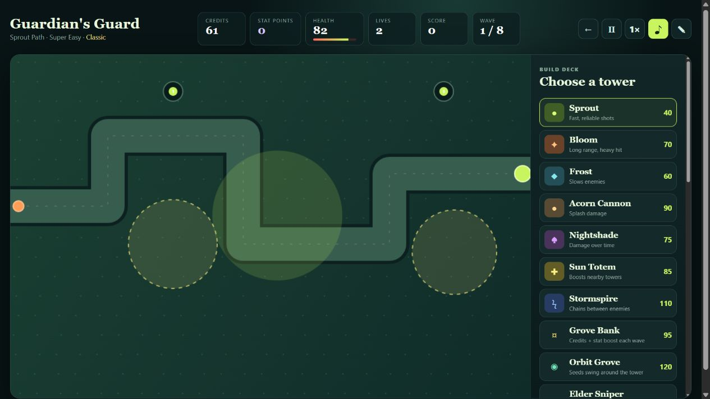

# Verdant Guard

### [▶ Play Verdant Guard now](https://theheeha.github.io/Verdant-Guard/)

Verdant Guard is a polished tower-defense game built with HTML, CSS, and JavaScript. Choose your Guardian, defend the Heartwood, and adapt as increasingly dangerous enemies enter the forest.

## The mission

Enemies travel along a visible path toward the Heartwood. Build towers on open terrain, earn credits by defeating enemies, and survive every wave. Escaped enemies damage your health; if it reaches zero, you lose a life and continue with restored health while another life remains.

## How to play

1. Enter a Guardian name, choose a map and difficulty, and select your starting lives.
2. Choose Classic, Story Campaign, Endless, Daily Challenge, or Sandbox mode.
3. Add optional challenge modifiers and choose an unlocked visual style.
4. Pick a tower from the build deck and click open ground to place it.
5. Start the next wave and adapt your defenses between battles.
6. Select a placed tower to upgrade it, change targeting, move it, sell it, or spend Stat Points on that specific tower.

## Modes and progression

- **Classic:** Play the standard eight-wave defense and earn permanent map victories.
- **Story Campaign:** Follow an extended defense with additional progression.
- **Endless:** Continue through unlimited scaling waves and recurring bosses.
- **Daily Challenge:** Play a date-based map and modifier combination.
- **Sandbox:** Test strategies with abundant credits, invincibility, and a selectable starting wave.
- **Achievements and encyclopedia:** Complete challenges and discover enemy entries while playing.
- **Guardian progression:** Earn XP, increase your Guardian Level, and unlock cosmetic tower styles.
- **Tutorials & Map Explorer:** Use interactive lessons for core systems, every mode and modifier, or inspect each map's important terrain.

## All 21 towers

| Tower | Role |
| --- | --- |
| Sprout | Fast, reliable single-target shots |
| Bloom | Long-range heavy damage |
| Frost | Slows enemies |
| Acorn Cannon | Area splash damage |
| Nightshade | Poison damage over time |
| Sun Totem | Boosts nearby towers |
| Stormspire | Chain lightning |
| Grove Bank | Credits and stronger Stat Point rewards |
| Orbit Grove | Orbiting seeds damage nearby enemies |
| Elder Sniper | Extreme range and damage with a slow reload |
| Laser Vine | A beam that grows stronger on one target |
| Boomerang Tree | Hits enemies on the way out and back |
| Tesla Root | Shocks every enemy in range |
| Bee Hive | Releases independent hunter bees |
| Portal Tower | Teleports enemies backward |
| Mirror Tower | Copies the nearest attack tower |
| Executioner | Finishes enemies below 20% health |
| Treasure Hunter | Nearby kills can drop bonuses |
| Ancient Oak | Blocks the path until destroyed |
| Drone Nest | Launches reusable seeker drones |
| Gravity Well | Pulls and slows nearby enemies |

## Stat Points

Stat Points are earned during ranked play and from special tower effects. Select a placed tower to spend points on its individual damage, range, or fire-rate stats. Upgrades belong only to that tower, remain with it when the game is saved and reloaded, and are not transferred to other towers or refunded when it is sold.

## Accounts, guest play, mobile, and installation

- Continue as a **Guest** to start playing immediately.
- Create an **account** for profiles, friends, cloud features, groups, and shared maps.
- Choose **Desktop** or **Mobile** layout; mobile gameplay supports touch controls and landscape play.
- Use **Install app** to add the Progressive Web App to a supported device for an app-like launch and offline game assets.
- Use **Suggestions & Feedback** from the home screen or the in-game toolbar to send ideas and bug reports to the review team.

## Strategy notes

Medium and Hard maps contain placement-blocking obstacles. Special terrain can increase range or damage, while bramble traps slow enemies. Optional modifiers add faster swarms, tougher armored ranks, reduced income, or a one-tower-type restriction.

Later waves introduce Runners, Ironbacks, regenerating Lifeblooms, Splitters, Menders, and multiple bosses with armor, shields, or summoning powers.

## Built with

- HTML5 Canvas
- CSS
- Plain JavaScript
- Web Audio API
- Supabase accounts and community data
